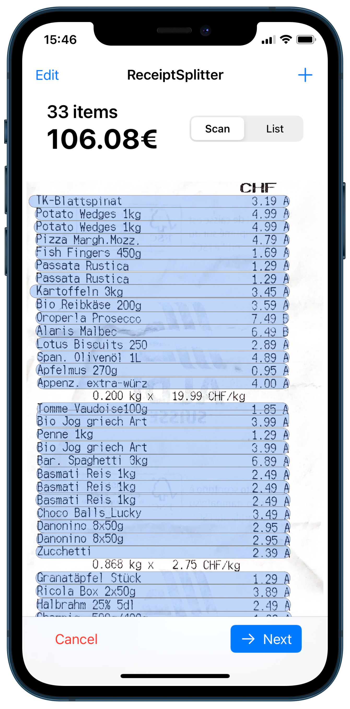
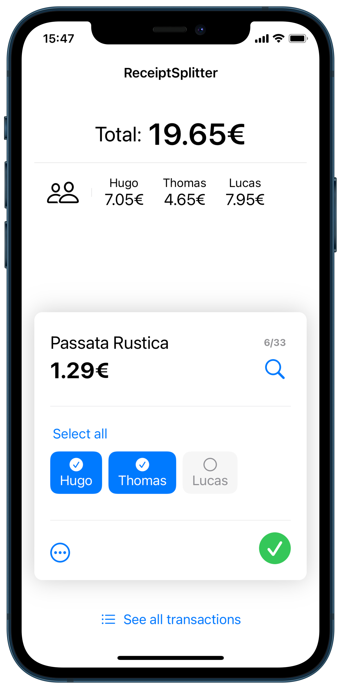
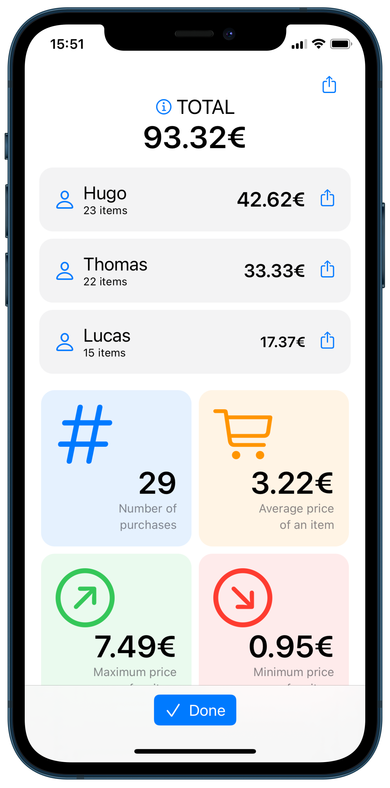
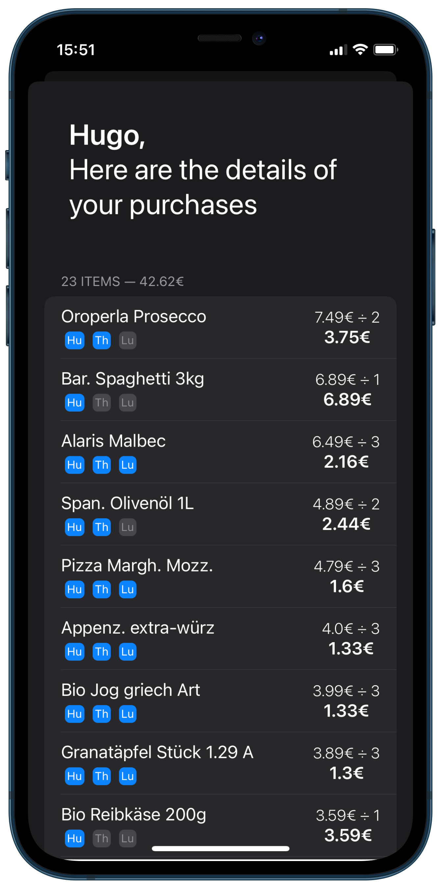

<h1> ReceiptSplitter
  
</h1>

ReceiptSplitter is an app for iOS and iPadOS, that allows a group of people to easily share expenses from a common receipt.
For example, roommates can do their shopping and pay for everything together.
Afterwards, one of them can scan the receipt, and attribute each expense to one person, several people or the whole group.
The app will calculate everyone's totals, which can be easily shared.

    
    
    
    

*Images from left to right:* The interface showing the results of the image recognition of items on the receipt | The interface to specify who should pay the current item | The result interface, telling how much each person owes | The app is also available in dark mode!

## Quick demo

https://user-images.githubusercontent.com/67365803/155002033-fa772923-dcf6-47d2-8722-7229cf7b9f25.mp4

## Features
- [x] Scan any receipt, regardless of the brand
- [x] Use it from two to an unlimited number of people
- [x] Quickly display images corresponding to the item name on the receipt, to easily understand what it refers to
- [x] Share the results using any app you want
- [x] Minimalist and native design for iOS
- [X] Dark Mode fully supported
- [x] Add, delete or modify items on the fly
- [x] Easily correct small errors of image recognition
- [x] Handles reductions (with negative amounts)
- [x] Export the scanned receipt 
- [x] Export the detailed computation of the results (for everyone or for a single person)
- [x] Display and use the currency of your choice (€, $, £, ¥)
- [x] Save your most frequently used list of people
- [x] iPad optimized version that takes advantage of the large screen
- [x] Scan several receipts from the beginning to group all transactions 
- [x] Sort expenses by price to better manage your budget

## Upcoming features
- [ ] Save the results of the allocation of receipts 
- [ ] Add settings to hide tutorials, and to modify advanced image recognition parameters
- [ ] Integration to the [Tricount API](https://www.tricount.com/en/api)
- [ ] And hopefully, publication of ReceiptSplitter on the App Store

## Technical Details
- This app works on Apple devices running iOS 15 / iPadOS 15 or higher
- Developped using [SwiftUI](https://developer.apple.com/xcode/swiftui/), which results in native and fluid components and animations
- The image recognition part is achieved through Apple's [Vision](https://developer.apple.com/documentation/vision) Framework
- The only external dependency is [SlideOverCard](https://github.com/joogps/SlideOverCard), that provides beautiful tutorial cards
- This app is not (yet?) on the App Store, but if you have a Mac with Xcode installed, you can install it on your iPhone or iPad using your own signing certificate

