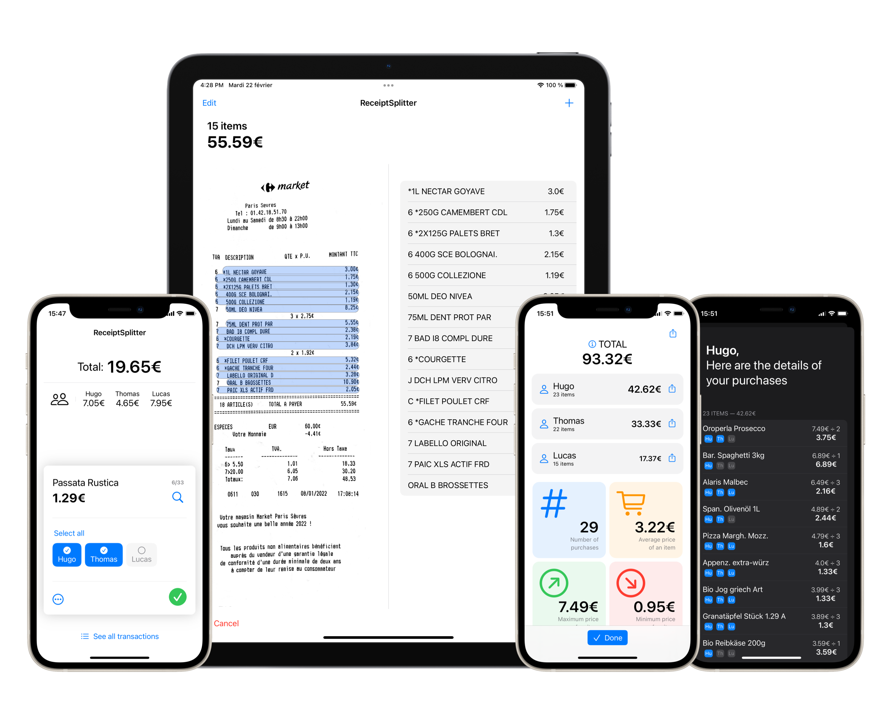

<h1> Split!
  
</h1>
 

  
  

Split! is an app for iOS and iPadOS, that allows a group of people to easily share expenses from a common receipt.
For example, roommates can do their shopping and pay for everything together.
Afterwards, one of them can scan the receipt, and attribute each expense to one person, several people or the whole group.
The app will calculate everyone's total, much faster than if you had to do it by hand.
 

<b>Coming to the App Store in early September 2022</b>

 

Image: some screenshots of Split!, on iPhone and iPad, in light and dark mode. 

## Quick demo

https://user-images.githubusercontent.com/67365803/159295049-a5201b9e-ec59-4356-a12f-6d40171c7870.mp4

## Features
### General
- [x] Scan any receipt, regardless of the brand, language or currency
- [x] Take your scan in a single tap, with no need to manually crop it
- [x] Reliable image recognition results, that are automatically verified by matching the price of all items to the total price
- [x] No account, no internet connection is required to run the application (everything happens locally and no data is shared)[^1]
- [x] Keeps a history of all receipts and of their distribution
- [x] Quickly display images corresponding to the item name on the receipt, to easily understand what it refers to

### Appearance
- [x] Minimalist and native design for iOS
- [x] Dark Mode fully supported
- [x] iPad optimized version that takes advantage of the large screen

### Sharing
- [x] Export the results to a [Tricount](https://www.tricount.com/) of your choice in just a tap[^2]
- [x] Share the results as text using any app you want (individual or complete results)
- [x] Export the scanned receipt

### And much more...
- [x] Save your most frequently used list of people
- [x] Display and use the currency symbol of your choice (€, $, £, ¥)
- [x] Scan several receipts from the beginning to group all transactions 
- [x] Add, delete or modify items on the fly during the attribution process
- [x] Handles reductions (with negative amounts)
- [x] Modify advanced image recognition parameters in settings

## Technical Details
- This app works on Apple devices running iOS 15 / iPadOS 15 or higher
- Developped using [SwiftUI](https://developer.apple.com/xcode/swiftui/), which results in native and fluid components and animations
- The image recognition part is achieved through Apple's [Vision](https://developer.apple.com/documentation/vision) Framework
- This project uses a single [Swift Packages](https://developer.apple.com/documentation/swift_packages) dependency: [SlideOverCard](https://github.com/joogps/SlideOverCard), that provides beautiful tutorial cards

## Highlights
Split! was selected as a **winner of Apple's Swift Student Challenge** at WWDC 2022. My project was further selected among the 12 best projects of this year, and presented in front of Tim Cook!

[^1]: Except when using Tricount's services, which require an internet connection and acceptance of [Tricount's privacy policy](https://www.tricount.com/en/privacy-policy).

[^2]: Split! is not affiliated in any way with Tricount. It does not use the official [Tricount API](https://www.tricount.com/en/api), but a [workaround](https://github.com/hugoqnc/Split/blob/main/Split/Model/Tricount.swift).
